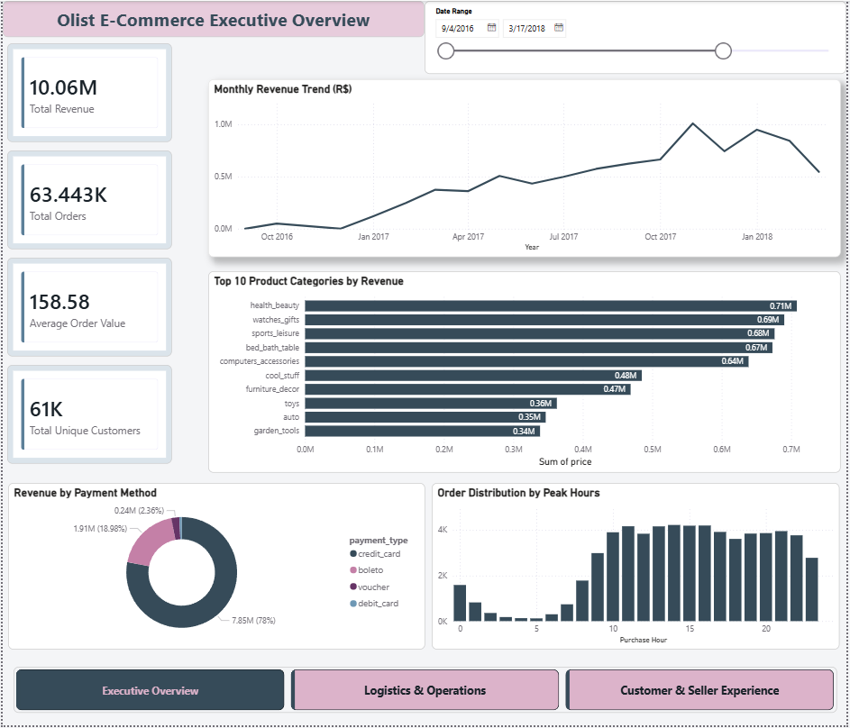
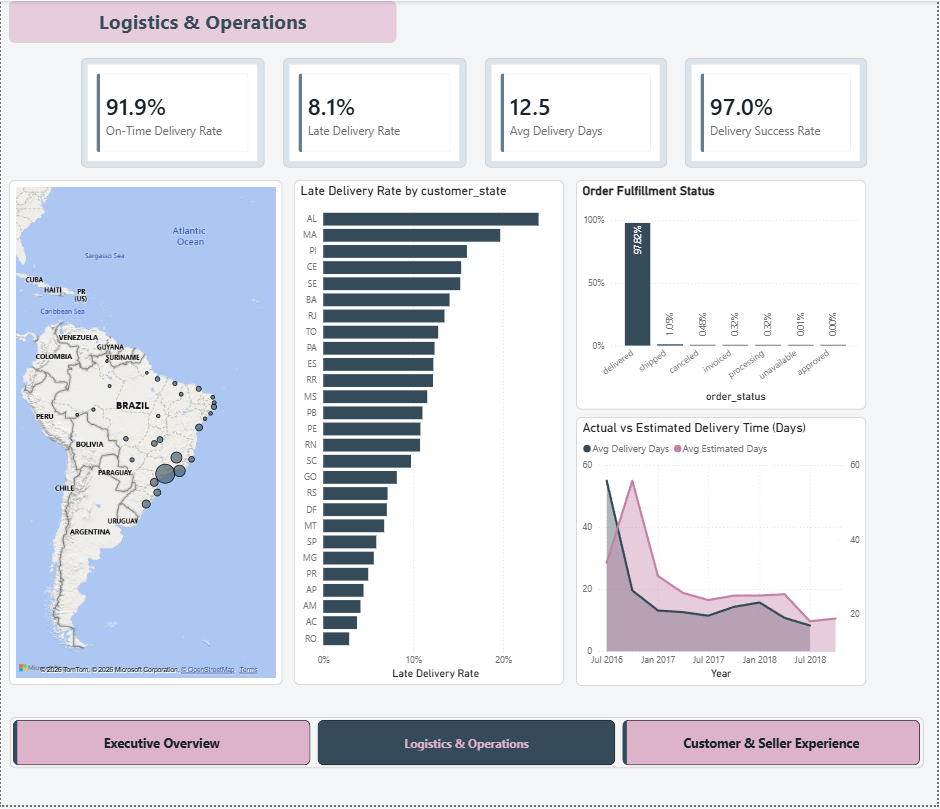
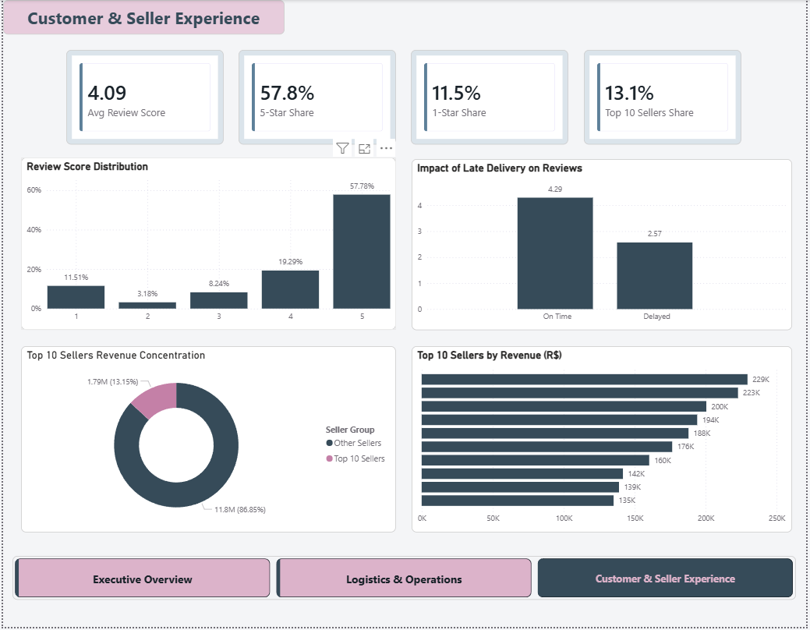

# Olist Brazilian E-Commerce Analytics & Executive BI Suite

An end-to-end Power BI business intelligence solution analyzing over 100,000 real-world e-commerce orders from the Brazilian marketplace Olist. This project transforms complex relational data into actionable strategic insights across executive performance, logistics operations, and customer-seller dynamics.

---

## 📌 Business Overview & Objective
Olist connects small businesses across Brazil to leading e-commerce channels. Managing a continental-scale operation introduces key operational challenges:
* Significant regional delivery variance across Brazilian states.
* Severe customer satisfaction churn driven by delivery delays.
* Marketplace reliance and revenue concentration across top sellers.

The goal of this project was to design an interactive, three-page executive dashboard enabling leadership to identify bottlenecks, optimize logistics routes, and protect customer lifetime value.

---

## 📊 Dashboard Architecture & Key Pages

### 1. Executive Overview
High-level strategic pulse of the business:
* **Core Metrics:** Total Revenue (R$ 16.01M), Total Orders (99.4K+), Average Order Value (R$ 158.58), and 96K+ Unique Customers.
* **Monthly Revenue Trends:** Tracking growth trajectories and identifying annual seasonal spikes (notably Black Friday surges).
* **Category Performance:** High-margin drivers (`health_beauty`, `watches_gifts`) vs. volume drivers (`bed_bath_table`).
* **Customer Behavior:** Payment breakdown (78% Credit Card dominance) and hourly shopping peak windows.



---

### 2. Logistics & Operations
Supply chain visibility and geographic bottleneck detection:
* **Fulfillment Metrics:** 91.9% On-Time Delivery Rate, 8.1% Delay Rate, and 12.5 Days average shipping cycle.
* **Geographic Distribution:** High order concentration in South/Southeast hubs (São Paulo, Rio de Janeiro).
* **State Risk Matrix:** Ranking shipping delay rates by state, identifying high-friction northern destinations (e.g., AL, MA, PI with >15% delay rates).
* **Actual vs. Estimated Delivery Days:** Operational safety margin analysis across quarterly horizons.



---

### 3. Customer & Seller Experience
Reputation economics and marketplace resilience:
* **Review Economics:** Platform average review score of 4.09 with 57.8% 5-star ratings vs. 11.5% 1-star ratings.
* **Delivery Impact Correlation:** Quantifying review score drop from **4.29** (on-time orders) down to **2.57** (delayed orders).
* **Seller Concentration:** Top 10 sellers accounting for ~13.1% of total marketplace revenue.



---

## 💡 Key Business Insights

| Insight Area | Analytical Finding | Business Implication |
| :--- | :--- | :--- |
| **Logistics Bottlenecks** | Orders to remote northern states experience double the delivery cycle compared to Southeast hubs. | Freight pricing and estimated delivery promises must be dynamically regionalized. |
| **Delay vs. Sentiment** | Shipping delays are the primary contributor to negative 1-star reviews (dropping sentiment by 1.72 points). | Delivery SLA management directly impacts repeat purchase potential. |
| **Revenue Concentration** | 13.1% of platform GMV relies on just 10 key merchants out of 3,000+ active sellers. | Requires dedicated key-account seller management to mitigate supplier churn risk. |

---

## 🚀 Strategic Recommendations

1. **Regional Fulfillment Hubs:** Partner with local 3PL warehousing in the Northeast corridor to reduce the 12.5-day cycle time and minimize transit risk.
2. **Proactive SLA Buffers & Automated Care:** Automatically trigger service-recovery vouchers for shipments tracking past their estimated delivery date before a 1-star review is lodged.
3. **Seller Incentive Alignment:** Tie marketplace commission discounts to seller dispatch speed and fulfillment reliability.

---

## 🛠️ Tech Stack & Methods
* **BI Tool:** Microsoft Power BI Desktop
* **Data Modeling:** Star Schema architecture, relational integrity, customized surrogate keys.
* **Analytics Engine:** Advanced DAX (Time Intelligence, dynamic filtering, conditional formatting, dynamic segmentation).
* **UI/UX Design:** Uniform spacing, consistent typography, custom page navigation, accessibility-conscious dark slate/plum palette.

---

## 📂 Repository Structure
```text
├── 01_executive_overview.png           # High-resolution screenshot of Page 1
├── 02_logistics_operations.png          # High-resolution screenshot of Page 2
├── 03_customer_seller_experience.png   # High-resolution screenshot of Page 3
├── Olist_Analytics_Template.pbit       # Power BI Template (Data model, measures & layout)
├── Olist_Dashboard_Report.pdf          # Multi-page executive PDF presentation
└── README.md                           # Business case study & documentation

---

## 💻 How to View the Project
1. **Interactive Review:** Download and open `Olist_Dashboard_Report.pdf` for full visual presentation across all 3 pages.
2. **Technical Inspection:** Download `Olist_Analytics_Template.pbit` and open with Microsoft Power BI Desktop to examine the data model, DAX measures, and UI styling.
